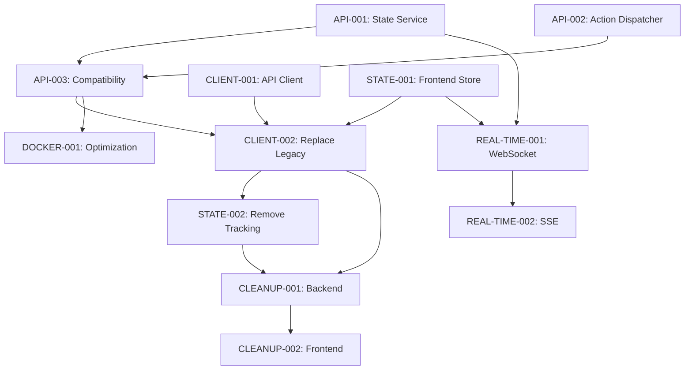

# Backend/Frontend Communication Simplification Project

## Overview
This project completely refactors the communication system between the Midori AI AutoFighter backend and frontend to eliminate complexity, reduce bugs, and optimize for Docker Compose deployment. The current system has multiple overlapping API patterns, complex state management, and mixed communication approaches that have evolved organically and need comprehensive simplification.

## Current Issues
- **Multiple API Layers**: Legacy run-specific APIs, new UI-centric APIs, direct service endpoints
- **Complex State Management**: Manual run ID tracking, polling mechanisms, complex synchronization
- **Mixed Communication Patterns**: Inconsistent response formats, multiple discovery mechanisms
- **Frontend Complexity**: Dual API systems, complex state management across multiple files
- **Technical Debt**: Overlapping functionality, duplicate code patterns, confusing architecture

## Target Architecture

### Unified Communication Model
1. **Single API Gateway**: 4 main endpoints instead of 20+ legacy endpoints
2. **State-Centric Design**: Backend as single source of truth, frontend purely reactive
3. **Action-Based Commands**: Simple command/response pattern for all interactions
4. **Real-time Updates**: WebSocket/SSE for live updates, eliminating polling
5. **Docker-Optimized**: Simplified service discovery and networking for containers

### Core Endpoints (Final State)
- `GET /api/state` - Returns complete current state
- `POST /api/action` - Accepts any user action  
- `GET /api/health` - Health check and monitoring
- `GET /api/events` - Server-sent events or WebSocket for real-time updates

## Implementation Plan

### Phase 1: Foundation (Tasks 1-4)
**High Priority - Core Infrastructure**

1. **[API-001: Unified State Service](./03c51eea-api-unified-state-service.md)**
   - Central backend service aggregating all game state
   - Single response format for all state data
   - Foundation for simplified communication

2. **[API-002: Unified Action Dispatcher](./abdee132-api-unified-action-dispatcher.md)**
   - Centralized action handling system
   - Consistent request/response format
   - Replaces endpoint-specific handlers

3. **[CLIENT-001: Simplified API Client](./b4fddf21-client-unified-api-client.md)**
   - Single frontend API client
   - Eliminates run ID tracking and complex discovery
   - Built-in error handling and retry logic

4. **[STATE-001: Single Frontend Store](./389ab94b-state-unified-frontend-store.md)**
   - Unified reactive state management
   - Automatic UI updates from backend changes
   - Eliminates manual state synchronization

### Phase 2: Integration (Tasks 5-8)
**Medium Priority - System Integration**

5. **[API-003: Backward Compatibility](./5a1fbf78-api-backward-compatibility.md)**
   - Maintains existing endpoints during migration
   - Feature flags for gradual rollout
   - Zero downtime migration path

6. **[CLIENT-002: Replace Legacy Calls](./48a24854-client-replace-legacy-calls.md)**
   - Migrate all components to unified patterns
   - Eliminate complex API logic in components
   - Comprehensive testing of migrated functionality

7. **[STATE-002: Remove Run ID Tracking](./efb5cbdb-state-remove-tracking.md)**
   - Eliminate all run ID variables and polling
   - Simplify component lifecycle
   - Performance improvement from reduced polling

8. **[DOCKER-001: Docker Optimization](./b0289cdb-docker-optimize-networking.md)**
   - Optimize for Docker Compose networking
   - Simplified service discovery
   - Container-specific performance improvements

### Phase 3: Real-time Features (Tasks 9-10)
**Lower Priority - Enhanced Communication**

9. **[REAL-TIME-001: WebSocket Support](./00c625eb-realtime-websocket-support.md)**
   - Real-time bidirectional communication
   - Immediate battle updates and notifications
   - Connection management and fallback

10. **[REAL-TIME-002: Server-Sent Events](./24cb5d13-realtime-server-sent-events.md)**
    - Alternative to WebSocket for better compatibility
    - One-way real-time updates
    - Proxy and firewall friendly

### Phase 4: Cleanup (Tasks 11-12)
**Final Phase - Technical Debt Removal**

11. **[CLEANUP-001: Remove Legacy Endpoints](./eeaf6798-cleanup-legacy-endpoints.md)**
    - Delete all deprecated API endpoints
    - Remove complex routing patterns
    - Eliminate duplicate functionality

12. **[CLEANUP-002: Remove Deprecated Frontend](./94f4dea6-cleanup-deprecated-frontend.md)**
    - Delete deprecated components and utilities
    - Optimize bundle size and performance
    - Finalize simplified architecture

## Task Dependencies

## Expected Benefits

### For Developers
- **80% reduction** in frontend API complexity
- **Single source of truth** for all state management
- **Consistent patterns** throughout codebase
- **Simplified debugging** with unified error handling
- **Faster development** with clear architecture

### For Users
- **Real-time updates** without polling overhead
- **Better performance** from optimized communication
- **More reliable** state consistency
- **Improved responsiveness** in Docker environment

### For System
- **Reduced network traffic** by eliminating continuous polling
- **Lower maintenance burden** with simplified codebase
- **Better scalability** with stateless frontend design
- **Docker-optimized** networking and service discovery

## Risk Mitigation

### Backward Compatibility
- Compatibility layer maintains existing functionality during migration
- Feature flags allow gradual rollout and easy rollback
- Comprehensive testing at each phase

### Performance
- Performance testing at each phase
- Benchmark comparisons with current system
- Optimization opportunities identified throughout

### Development Process
- Tasks can be worked on independently where possible
- Clear acceptance criteria and testing requirements for each task
- Regular integration testing to catch issues early

## Success Metrics

### Code Complexity
- **60%+ reduction** in total API-related code
- **Elimination** of duplicate communication patterns
- **Single point of integration** for all backend communication

### Performance
- **50%+ reduction** in background network requests
- **Improved response times** with optimized communication
- **Reduced memory usage** from simplified state management

### Maintainability
- **Consistent architecture** throughout application
- **Clear separation of concerns** between frontend and backend
- **Simplified onboarding** for new developers

## Delivery Timeline

### Estimated Effort by Phase
- **Phase 1 (Foundation)**: 12-17 days (3-4 days per task)
- **Phase 2 (Integration)**: 16-22 days (4-6 days per task)  
- **Phase 3 (Real-time)**: 6-8 days (3-4 days per task)
- **Phase 4 (Cleanup)**: 7-9 days (3-5 days per task)

**Total Estimated Effort**: 41-56 days

### Parallel Development
Some tasks can be worked on simultaneously:
- API-001 and CLIENT-001 can start together
- API-002 and STATE-001 can be developed in parallel
- Real-time tasks can be developed independently
- Cleanup tasks can begin once migration is stable

## Getting Started

### For Coders
1. **Choose a task** from Phase 1 (Foundation tasks have highest priority)
2. **Read the detailed task document** for acceptance criteria and implementation details
3. **Set up development environment** according to repository instructions
4. **Create feature branch** for the specific task
5. **Implement and test** according to task requirements
6. **Submit for review** when acceptance criteria are met

### For Task Master
1. **Monitor task progress** and update status
2. **Coordinate between coders** working on dependent tasks
3. **Review completed tasks** for quality and completeness
4. **Prioritize task assignment** based on dependencies and team capacity
5. **Update this overview** as tasks are completed

## Questions and Coordination

- All tasks include detailed acceptance criteria and testing requirements
- Dependencies are clearly marked to avoid conflicts
- Each task can be worked on independently within its phase
- Regular integration testing recommended to catch issues early
- Task Master will coordinate cross-task dependencies and priorities